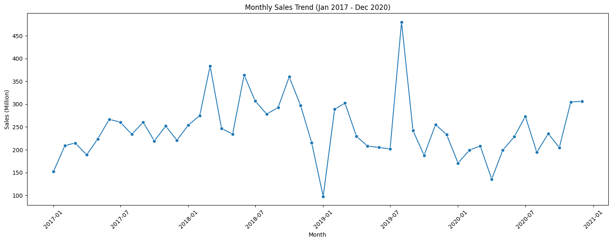
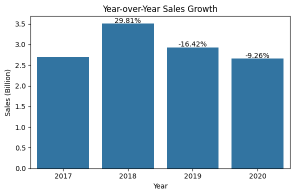
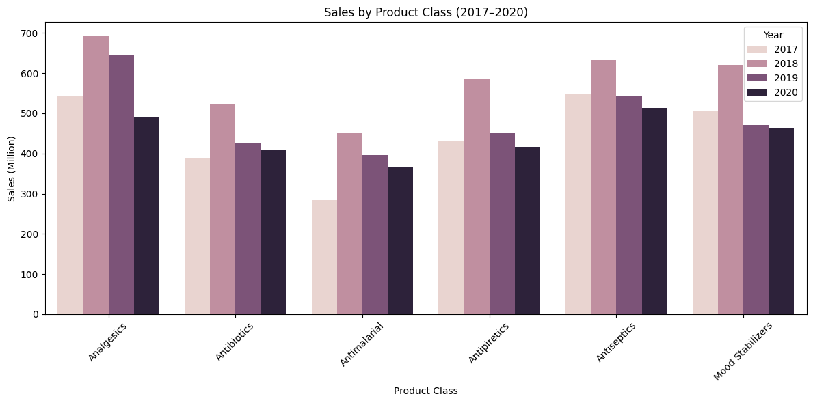

# Sales & Market Intelligence Analysis in the Pharmaceutical Industry
Exploratory Data Analysis to Identify Sales Trends, Product Performance, and Market Opportunities

## Executive Summary
### •	Tools: 
Python (Pandas, Matplotlib, Seaborn), Jupyter Notebook

### •	Business Problem

Perusahaan memiliki data transaksi penjualan obat selama periode 2017–2020, namun belum memiliki gambaran yang jelas mengenai performa bisnis dari waktu ke waktu. Melalui analisis ini, saya ingin mengidentifikasi tren penjualan, kategori produk, wilayah, channel distribusi, dan performa tim penjualan yang paling berkontribusi terhadap Sales. Hasil analisis diharapkan dapat membantu stakeholder memahami faktor utama yang mendorong maupun menghambat pertumbuhan penjualan, sehingga strategi pemasaran dan distribusi dapat difokuskan pada area yang memberikan dampak bisnis terbesar. 

### •	Solution: 
Melakukan Exploratory Data Analysis (EDA) untuk mengevaluasi tren penjualan, performa produk, channel distribusi, customer, dan Sales Representative sehingga dapat menghasilkan rekomendasi bisnis berbasis data.

## Methodology
•	Python (Pandas) digunakan untuk membersihkan data, memvalidasi kualitas data, serta mengolah data transaksi menjadi metrik bisnis yang mudah dianalisis. 

•	Exploratory Data Analysis (EDA) dilakukan untuk mengidentifikasi tren penjualan, pola musiman, performa produk, customer, distributor, wilayah, channel distribusi, serta perubahan performa bisnis dari tahun ke tahun. 

•	Statistical Analysis digunakan untuk menghitung KPI utama seperti Total Sales, Total Quantity, Average Order Value (AOV), kontribusi Product Class, serta Year-over-Year (YoY) Growth. 

•	Data Visualization digunakan untuk menyajikan insight melalui berbagai grafik sehingga stakeholder dapat memahami performa bisnis, menemukan peluang pertumbuhan, serta mengidentifikasi area yang memerlukan perhatian lebih lanjut. 

## Specific Skills
•	Python: Data Cleaning, Exploratory Data Analysis (EDA), Data Aggregation, Statistical Summary, Business Insight Generation, Data Visualization 

•	Libraries: Pandas, NumPy, Matplotlib, Seaborn 

## Results & Business Recommendation
Analisis terhadap 254K transaksi penjualan menunjukkan bahwa perusahaan menghasilkan Total Sales sebesar 11,80 Billion dengan lebih dari 28,6 juta unit produk terjual selama periode 2017–2020. Penjualan mengalami pertumbuhan yang cukup tinggi pada 2018 (+29,81%), namun kembali mengalami penurunan pada 2019 (-16,42%), sehingga pertumbuhan bisnis belum berlangsung secara konsisten.

 
 

Analisis juga menunjukkan bahwa sebagian besar Sales berasal dari beberapa Product Class, customer, distributor, kota, dan Sales Representative tertentu. Kondisi ini menunjukkan bahwa perusahaan masih bergantung pada beberapa kontributor utama dalam menghasilkan penjualan. Selain itu, seluruh Product Class mengalami penurunan penjualan pada tahun 2020 dibandingkan tahun sebelumnya, sehingga diperlukan evaluasi terhadap strategi penjualan dan distribusi yang diterapkan.

 

### Berdasarkan hasil analisis tersebut, beberapa rekomendasi yang dapat dipertimbangkan adalah:
• Memprioritaskan Product Class dengan kontribusi Sales tertinggi melalui optimalisasi promosi dan ketersediaan stok.

• Mengembangkan customer dan wilayah dengan performa rendah untuk mengurangi ketergantungan pada pasar utama.

• Mengevaluasi strategi penjualan pasca-2018 guna mengidentifikasi penyebab penurunan performa dan menyusun strategi pertumbuhan yang lebih efektif.

• Menerapkan best practice dari Sales Representative terbaik untuk meningkatkan produktivitas dan pemerataan kinerja tim penjualan.

Implementasi rekomendasi tersebut diharapkan dapat meningkatkan efektivitas penjualan, memperluas jangkauan pasar, serta mendorong pertumbuhan Sales yang lebih berkelanjutan.

## Next Steps
•	Sales Forecasting untuk mengidentifikasi peluang pertumbuhan penjualan di periode berikutnya. 

•	Customer Segmentation untuk meningkatkan efektivitas promosi dan loyalitas pelanggan. 

•	Market Intelligence Dashboard untuk memonitor KPI penjualan secara real-time. 

•	Market & Competitor Analysis untuk mengidentifikasi peluang pasar dan mendukung strategi bisnis yang lebih kompetitif.
